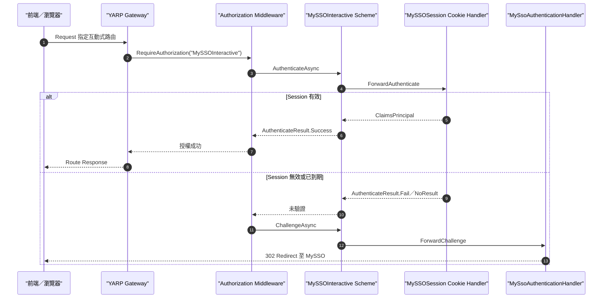
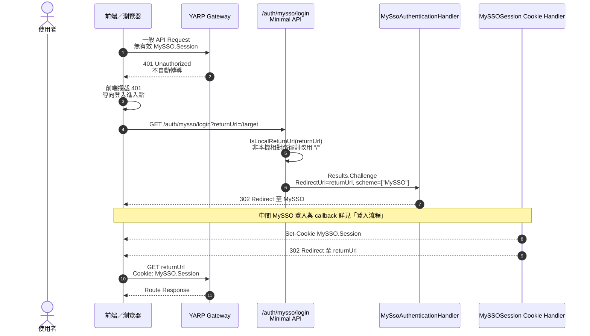
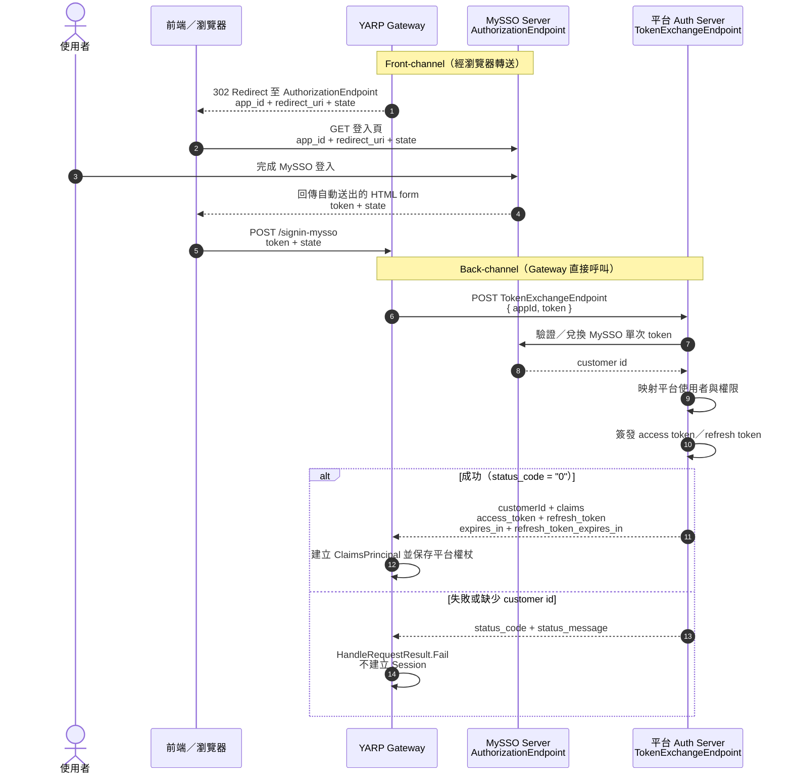
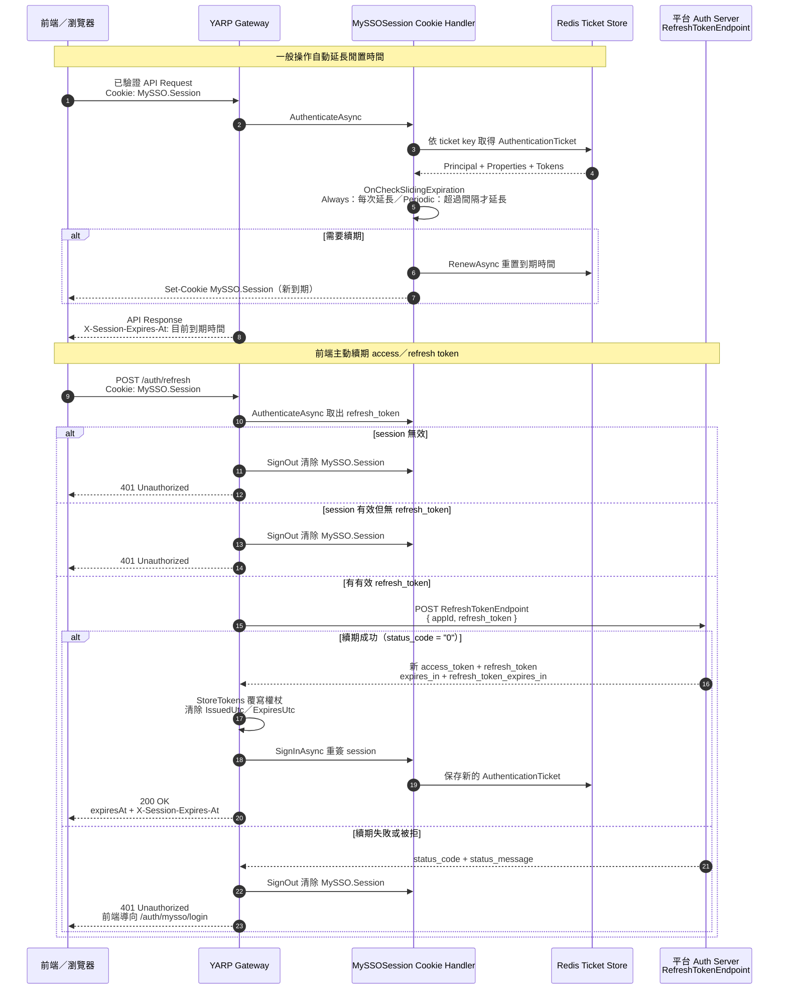

# MySSO Authentication 完整時序圖

本文件描述 YARP Gateway 目前實作的 MySSO remote authentication flow。

## 元件與識別名稱

| 類型 | 名稱 |
| --- | --- |
| Remote authentication scheme | `MySSO` |
| Session Cookie scheme | `MySSOSession` |
| 指定路由互動式 scheme／policy | `MySSOInteractive` |
| Session Cookie | `MySSO.Session` |
| Policy scheme | `GatewayAuthentication` |
| 登入入口 | `/auth/mysso/login` |
| Session 狀態查詢 | `/auth/session` |
| 主動續期入口 | `/auth/refresh` |
| 到期時間回應 header | `X-Session-Expires-At` |
| 預設 callback | `/signin-mysso` |
| 外部逐 request 驗證 scheme | `ExternalToken` |

## 登入流程

```mermaid
sequenceDiagram
    autonumber

    actor U as 使用者
    participant B as 前端／瀏覽器
    participant G as YARP Gateway
    participant AR as ASP.NET Core Authentication
    participant H as MySsoAuthenticationHandler
    participant DP as Data Protection
    participant M as MySSO Server
    participant C as IMySsoTokenExchangeClient
    participant A as 平台 Auth Server
    participant R as Redis Ticket Store

    U->>B: 點選登入
    B->>G: GET /auth/mysso/login?returnUrl=/target

    G->>G: 驗證 returnUrl 為本機相對路徑
    G->>AR: Challenge("MySSO")
    AR->>H: HandleChallengeAsync(properties)

    H->>H: GenerateCorrelationId
    H-->>B: Set-Cookie Correlation Cookie<br/>SameSite=None&#59; Secure
    H->>DP: Protect(AuthenticationProperties)
    DP-->>H: 受保護的 state

    H->>H: 建立 callback URL<br/>/signin-mysso
    H-->>B: 302 Redirect 至 MySSO<br/>app_id + redirect_uri + state

    B->>M: GET MySSO 登入頁
    U->>M: 完成 MySSO 登入
    M-->>B: 回傳自動送出的 HTML form

    alt 預設：Form POST
        B->>G: POST /signin-mysso<br/>token + state
    else 選配：AllowQueryStringCallback = true
        B->>G: GET /signin-mysso?token=...&state=...
    end

    G->>AR: Authentication Middleware 接手 CallbackPath
    AR->>H: HandleRemoteAuthenticateAsync

    H->>DP: Unprotect(state)
    DP-->>H: AuthenticationProperties
    H->>H: ValidateCorrelationId
    H-->>B: 刪除 Correlation Cookie

    alt state 或 correlation 無效
        H-->>AR: HandleRequestResult.Fail
        AR-->>B: 登入失敗，不建立 Session
    else state 與 correlation 有效
        H->>H: 讀取 MySSO 單次 token
        H->>C: ExchangeAsync(token, options)
        C->>A: POST TokenExchangeEndpoint<br/>{ appId, token }

        A->>M: 驗證／兌換 MySSO 單次 token
        M-->>A: customer id
        A->>A: 映射平台使用者與權限
        A->>A: 簽發 access token／refresh token
        A-->>C: customerId + claims + tokens + 到期資訊
        C-->>H: MySsoTokenExchangeResult

        alt 交換失敗或缺少 customer id
            H-->>AR: HandleRequestResult.Fail
            AR-->>B: 登入失敗，不建立 Session
        else 交換成功
            H->>H: 建立 ClaimsPrincipal
            H->>H: StoreTokens<br/>access_token<br/>refresh_token<br/>expires_at<br/>refresh_token_expires_at
            H-->>AR: AuthenticationTicket

            AR->>AR: SignInAsync("MySSOSession")

            AR->>R: 保存完整 AuthenticationTicket
            R-->>AR: Session key
            AR-->>B: Set-Cookie MySSO.Session=&#59;session-key&gt;

            AR-->>B: 302 Redirect 至原始 returnUrl
        end
    end
```



## 指定路由轉導登入

一般路由不會自動轉導登入。只有 `/auth/mysso/login` 或明確套用 `MySSOInteractive` policy 的路由會在 session 無效時 challenge MySSO。



Minimal API 可使用：

```csharp
route.RequireAuthorization(MySsoAuthenticationDefaults.InteractivePolicy);
```

YARP route 可使用：

```json
{
  "AuthorizationPolicy": "MySSOInteractive"
}
```

## 登入進入點 /auth/mysso/login

一般路由不自動轉導，只回 401。前端攔截 401 後，主動把瀏覽器導向顯式登入進入點 `/auth/mysso/login?returnUrl=<目前頁面>`。
此進入點是 `Program.cs` 的 minimal API，直接對 `MySSO` remote scheme 發出 `Challenge`（不需要 controller）。



## 與外部服務互動

聚焦 Gateway 與兩個外部服務（MySSO Server、平台 Auth Server）的互動。
Gateway 與 MySSO Server 走 front-channel（經由瀏覽器轉送），與平台 Auth Server 走 back-channel（Gateway 直接呼叫）。



## Session 續期與前端取得到期時間

MySSO session cookie 為 `HttpOnly`，前端無法直接讀取；到期時間由 Gateway 透過 `X-Session-Expires-At` 回應 header 提供。
session ticket（含 access／refresh token）一律保存在 Redis ticket store，cookie 只存 ticket key。
「有操作就延長」由 sliding expiration 達成，續期策略由 `SessionRenewalMode` 設定：`Always` 每個已驗證請求都延長；`Periodic` 距上次續期超過 `SessionRenewalIntervalSeconds` 才延長。



前端使用方式：
- 登入導回後，可選擇呼叫 `GET /auth/session` 取得 `expiresAt` 與 `idleTimeoutSeconds`，或直接在第一支 API 回應讀 `X-Session-Expires-At`。
- 之後每支 API 回應讀 `X-Session-Expires-At` 重置本地倒數。
- 倒數逼近 0 時呼叫 `POST /auth/refresh` 續期；若回 401 則導向 `/auth/mysso/login?returnUrl=<目前頁>` 重新登入。

## 後續 API Request

```mermaid
sequenceDiagram
    autonumber

    participant B as 前端／瀏覽器
    participant G as YARP Gateway
    participant P as GatewayAuthentication Policy
    participant C as MySSOSession Cookie Handler
    participant R as Redis Ticket Store
    participant T as AuthenticationTokenTransformProvider
    participant API as 下游 API

    B->>G: API Request<br/>Cookie: MySSO.Session

    G->>P: 選擇 Authentication Scheme
    P->>P: 未帶 Authorization Header<br/>且存在 MySSO.Session
    P-->>G: 選擇 MySSOSession

    G->>C: AuthenticateAsync

    C->>R: 依 ticket key 取得 AuthenticationTicket
    R-->>C: Principal + Properties + Tokens

    alt Session 無效或已到期
        C-->>G: AuthenticateResult.Fail／NoResult
        G->>C: Challenge MySSOSession
        C-->>B: 刪除 MySSO.Session<br/>401 Unauthorized，不轉導
    else Session 有效
        C-->>G: ClaimsPrincipal + AuthenticationProperties
        G->>G: 執行 Authorization Policy

        G->>T: 執行 YARP Request Transform
        T->>T: GetTokenAsync("access_token")
        T->>API: Authorization: Bearer &#59;access-token&gt;
        API-->>G: API Response
        G-->>B: API Response
    end
```



## 目前未實作

- 獨立的 touch endpoint；目前前端可透過 `GET /auth/session` 取得閒置倒數所需資訊，該請求也會觸發 sliding renewal。
- 依 customer id 建立可供強制登出的 Redis session 索引。
- 接收其他平台登入事件後撤銷 MySSO session。
- MySSO session logout endpoint。
- 將平台 access token 提供給前端的過渡端點；目前由 Gateway 保存並轉送下游 API。
